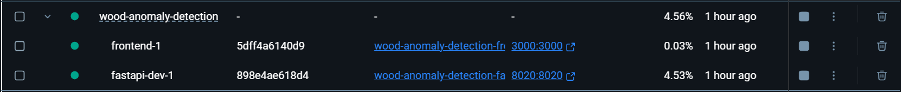
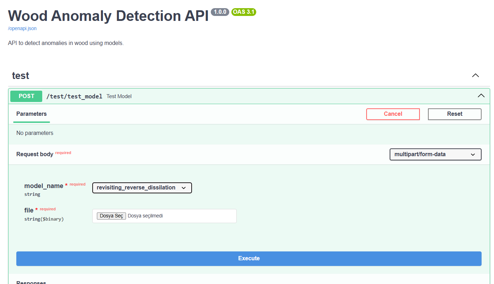
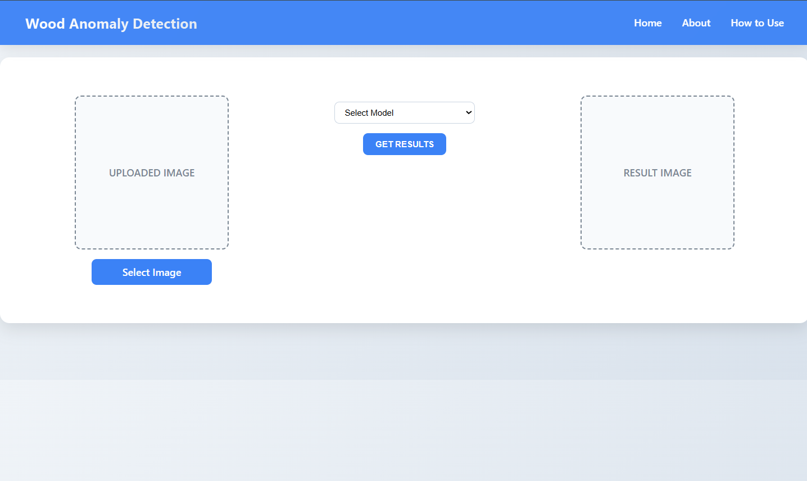
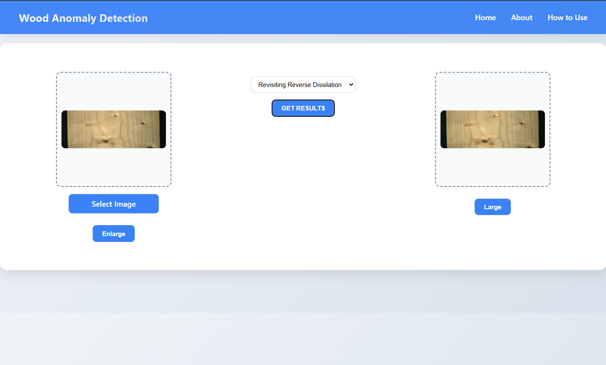
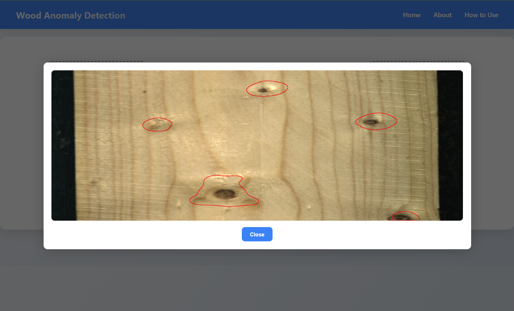

# Wood Anomaly Detection

## Table of Contents

- [📖 Introduction](#introduction)
- [✨ Features](#features)
- [🔧 Technologies Used](#technologies-used)
  - [🖥️ Frontend](#frontend)
  - [🧠 Backend](#backend)
  - [📊 Model Training](#model-training)
- [⬇️ Installation Instructions](#installation-instructions)
  - [📚 Training Models Using .ipynb Files (Google Colab)](#training-models-using-ipynb-files-google-colab)
  - [🧪 Testing Trained Models with User Interface](#testing-trained-models-with-user-interface)
  - [📁 Complete Folder Structure](#complete-folder-structure)
- [🖼️ Example Screenshots](#example-screenshots)
- [🔗 References](#references)
- [👥 Contributors](#contributors)

### Introduction

---

Wood Anomaly Detection is a deep learning-based system designed to identify surface defects and anomalies in wood materials.
This repository includes:

- Source code for training and experimentation in a Google Colab environment
- A backend API built with FastAPI to serve the trained model
- A React.js frontend for visualizing detection results

The system combines efficient model training, API integration, and an interactive UI to deliver end-to-end wood anomaly detection.

### Features

- Automatic detection of surface defects on wood using deep learning
- Real-time result visualization with a modern React.js interface
- Easy-to-use API powered by FastAPI
- Model training support via Google Colab

### Technologies Used

---

#### Frontend

- React.js – For building interactive user interfaces
- CSS – Styling and layout
- Responsive Design – Ensures usability across devices

#### Backend

- Python – Core programming language
- FastAPI – High-performance web framework for serving the model
- PyTorch – Deep learning framework for building and deploying the detection model

#### Model Training

- Google Colab – Cloud-based environment used for training and experimenting with models

### Installation Instructions

---

#### Training Models Using .ipynb Files (Google Colab)

---

0. Go to the `models` directory
1. Select the folder of the model you wish to train.
2. Download the corresponding `.ipynb` (Jupyter Notebook) file.
3. Download the `wood_dataset.zip` file provided.
4. Unzip the `wood_dataset` archive.
5. Upload the `.ipynb` file to your Google Colab environment.
6. Upload the unzipped `wood_dataset` to your Google Drive.
7. Follow the instructions in the notebook to:
   - Mount Google Drive
   - Locate the dataset path
   - Begin training by running the notebook cells step-by-step

> 💡 _Ensure you correctly link the dataset directory in the notebook as indicated in its instructions._

#### Testing Trained Models with User Interface

---

**0. Install Docker**

Make sure Docker is installed on your system before proceeding. You can download it here:

```url
https://www.docker.com/get-started/
```

**1. Clone the repository:**

```git
git clone https://github.com/cemlevent54/wood-anomaly-detection.git
```

**2. Navigate to the project directory:**

```
cd wood-anomaly-detection
```

**3. Download and prepare the dataset:**

- Go to the following link to install wood_dataset

```
https://mega.nz/file/SwJj1T4Z#N_3nBexATWOqRnyxpAV6y0DgBTgjInESphrjR5kkZ0E
```

- Download the `wood_dataset.zip` file
- Unzip the archive
- Change its name from `wood_dataset` to `images`
- Move the `images` folder into the `backend/api/app/` directory.

**4. Download and prepate trained models**

- Go to the following link to install trained models

```
https://mega.nz/file/rkw33YYY#hKp9AWYNgg6qqkdLds3LdpNfbn4-covf0sljyZZIaHA
```

- Download the `api_images_and_model_files.zip` file
- Unzip the archive
- Move the `modelfiles` folder into the `backend/api/app/` directory.

**5. Run the Project with Docker**

- Open Docker Desktop and make sure it is running.
- Open a terminal or command prompt, and navigate to the project directory:

```cmd
cd ..\wood-anomaly-detection
```

- Start the services with the following command:

```cmd
docker-compose -f docker-compose-dev.yml up --build -d
```

**6. Access the Applications**

- After that you have that screen in Docker:
  
  - 🌐 Frontend (React.js): `http://localhost:3000/`
    - Upload an image to analyze wood defects.
    - View the result on the interface.
  - 🔧 Backend (FastAPI Swagger UI): `http://localhost:8020/docs`
    - Test the API endpoints via Swagger

### Complete Folder Structure

---

You can look the project folder structure from here if you want to sure:

```
wood-anomaly-detection
|
├── backend
│   ├── api
│   │   └── app
│   │       ├── images
│   │       ├── modelfiles
│   │       ├── routes
│   │       ├── services
│   │       └── main.py
│   ├── venv
│   ├── .gitignore
│   ├── Dockerfile.dev
│   ├── requirements.txt
│
├── docs
|
├── models
│   ├── cpr
│   ├── Dinomaly
│   ├── efficientad
│   ├── GLASS
│   ├── INP-Former
│   ├── PBAS
│   ├── Revisiting-Reverse-Dissilation
│   ├── STPM_anomaly_detection
│   └── UniNet
|
├── woodanomalydetectionapp
│   ├── cpr
│   ├── src
│   ├── .gitignore
│   ├── Dockerfile.dev
│   ├── package-lock.json
│   ├── package.json
│   ├── tsconfig.json
|
├── .gitignore
├── docker-compose-dev.yml
└── README.md
```

### Example Screenshots

---










### References

- [UniNet: Unified Anomaly Detection Network](https://github.com/pangdatangtt/UniNet/)
- [STPM: Student–Teacher Feature Pyramid Matching](https://github.com/hcw-00/STPM_anomaly_detection/)
- [Revisiting Reverse Distillation for Anomaly Detection (CVPR 2023)](https://github.com/tientrandinh/Revisiting-Reverse-Distillation)
- [EfficientAD: Accurate Visual Anomaly Detection at Millisecond-Level Latencies](https://github.com/nelson1425/EfficientAD)
- [GLASS: A Unified Anomaly Synthesis Strategy with Gradient Ascent for Industrial Anomaly Detection and Localization](https://github.com/cqylunlun/glass)
- [CPR: Target before Shooting: Accurate Anomaly Detection and Localization under One Millisecond via Cascade Patch Retrieval](https://github.com/flyinghu123/cpr)
- [Dinomaly: The Less Is More Philosophy in Multi-Class Unsupervised Anomaly Detection](https://github.com/guojiajeremy/dinomaly)
- [INP-Former: Exploring Intrinsic Normal Prototypes within a Single Image for Universal Anomaly Detection](https://github.com/luow23/INP-Former)
- [Progressive Boundary Guided Anomaly Synthesis for Industrial Anomaly Detection](https://github.com/cqylunlun/PBAS)

### Project Video

Click the image to watch demo video!

[](https://www.youtube.com/watch?v=g0y9sFLKdYs)

---

### Contributors

---

This project was developed as a collaborative effort. Feel free to reach out to us for questions, collaboration opportunities, or feedback.

### 📌 Cem Levent Avcı

- 📧 **Email:** [cemlevent54@gmail.com](mailto:cemleventavci@gmail.com)

### 📌 Özgür Efe Erturan
